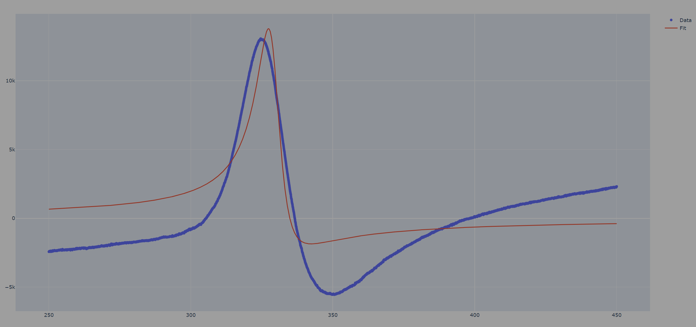

# Dysonian EPR Fitting

This Python script is used for modeling and fitting data to the Dysonian function. It uses the pandas, plotly.graph_objects, and lmfit libraries.

## How it works
1. Data Import: The script starts by importing data from a CSV file located in the CSVs directory.

2. Dysonian Function: The Dysonian function is defined in terms of an absorptive and a dispersive component.

3. Model Fitting: The script then fits the data to the Dysonian model using the lmfit library. Initial parameters for the model are defined, and bounds are set for these parameters. The fitting process omits any NaN values.

4. Results: The script prints a report of the fitting process and the best values for the parameters.

5. Plotting: Finally, the script plots the original data and the fitted model using plotly.graph_objects. The plot is displayed in a new browser window.

## Requirements
Python 3.x
pandas
plotly
lmfit

## Usage
To run the script, navigate to the directory containing the script and execute the following command in your terminal:

    python APK_Kristen-Dysonian-Attempt.py

Please ensure that the CSV file is located in the correct directory as specified in the script.

## Resources
- [Desmos](https://www.desmos.com/calculator/mflilpt3vx) for playing with initial parameter guesses
- [Dysonian Function Wiki](https://en.wikipedia.org/wiki/Dyson_series)

## to-do

- [ ] perform corrections to the data 
  - [ ] background
  - [ ] normalization
  - [ ] phase ?